# Investment Analysis Platform

**Uma plataforma de análise de investimentos que transforma dados financeiros em um processo repetível de screening, diligência, valuation e comunicação para comitê de investimento.**

Construí este projeto para integrar, em um único fluxo, tarefas que normalmente ficam fragmentadas entre Excel, PowerPoint e pesquisas manuais. No ambiente privado, a plataforma recebe exports locais do **S&P Capital IQ Pro**, normaliza os dados, testa sua consistência e aplica o mesmo framework analítico a todas as companhias da cobertura.

O sistema não tenta substituir o analista ou gerar uma recomendação automática. Ele organiza evidências, explicita premissas, identifica inconsistências e libera tempo para o trabalho que realmente exige julgamento: entender o negócio, revisar peers, questionar o consenso e construir uma tese.

Os materiais abaixo usam **Lululemon como case demonstrativo** para mostrar o fluxo completo, da triagem multiempresa ao forecast, DCF, sensitivities e memo para comitê de investimento.

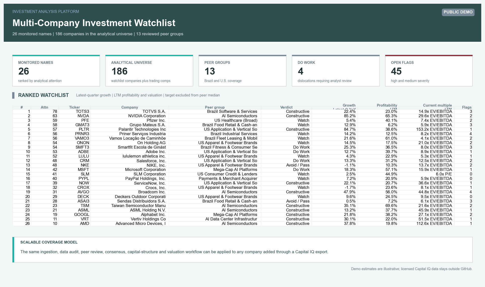

## Escala da análise

A demonstração pública contém **14 companhias** entre empresas monitoradas e trading comps. O ambiente privado ilustrado nos prints contém **186 companhias**, entre nomes monitorados e comparáveis, com **8 empresas priorizadas** na watchlist. O sistema não é limitado a esse universo: qualquer companhia adicionada pelos templates de exportação do Capital IQ passa pelo mesmo pipeline de financials, estimates, peers, capital structure, valuation e reporting.

Na prática, a plataforma permite:

- Monitorar várias empresas com o mesmo padrão analítico.
- Separar empresas da watchlist de companhias utilizadas apenas como comparáveis.
- Comparar nomes de setores e geografias diferentes sem misturar moedas ou períodos.
- Criar peer groups revisáveis, excluindo a própria empresa da mediana dos pares.
- Trocar a companhia selecionada e reconstruir automaticamente todas as análises aplicáveis.

> **Nota sobre os prints:** as imagens mostram uma execução ilustrativa do workflow privado para Lululemon. Os exports brutos do Capital IQ não são versionados. As premissas do case permanecem identificadas como draft e os outputs como indicativos, não como recomendação de investimento.

## Da informação à decisão

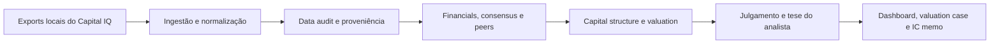

O fluxo foi desenhado para responder perguntas de investimento, não apenas para exibir dados:

- Onde vale a pena gastar tempo de diligência agora?
- O crescimento e as margens estão melhorando ou deteriorando?
- O valuation atual é sustentado pelos fundamentos e pelo consenso?
- Quais peers são realmente comparáveis e quais distorcem a mediana?
- O balanço suporta alavancagem adicional?
- Quanto do valor estimado depende do terminal value?
- Qual é a diferença entre o que o modelo calcula e o que o mercado já precifica?
- Quais riscos, catalisadores e perguntas para management precisam de análise humana?

## Visão por companhia

A tela de situação resume performance, qualidade financeira, leverage, valuation, sinais de atenção e a leitura de investimento. A página financeira preserva a diferença entre **latest quarter**, **LTM**, **NTM** e períodos projetados.

| Company Situation | Company Financials |
| --- | --- |
| 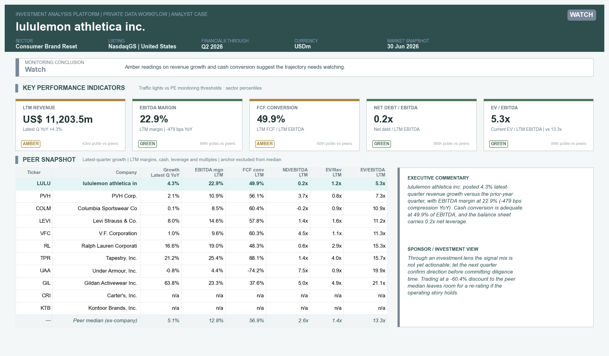 | 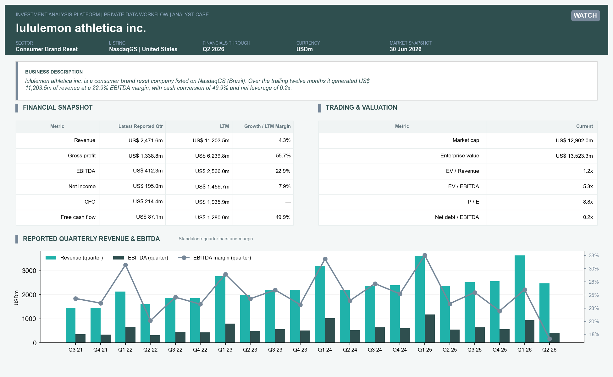 |

## Comparação e peer benchmarking

A plataforma permite comparar diferentes empresas lado a lado e, em seguida, aprofundar a análise dentro de um grupo de trading comps. Crescimento trimestral, margens LTM, cash conversion, leverage e múltiplos são identificados pela base temporal correta. A mediana dos peers **não inclui a empresa analisada**.

| Comparação entre companhias | Peer Benchmarking |
| --- | --- |
| 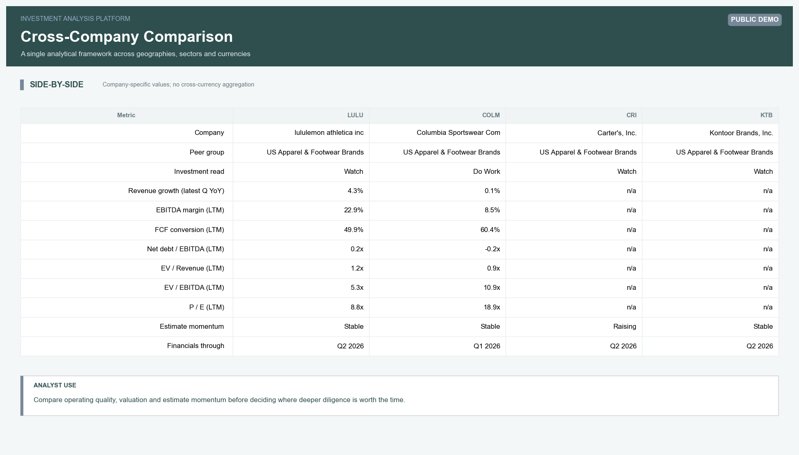 | 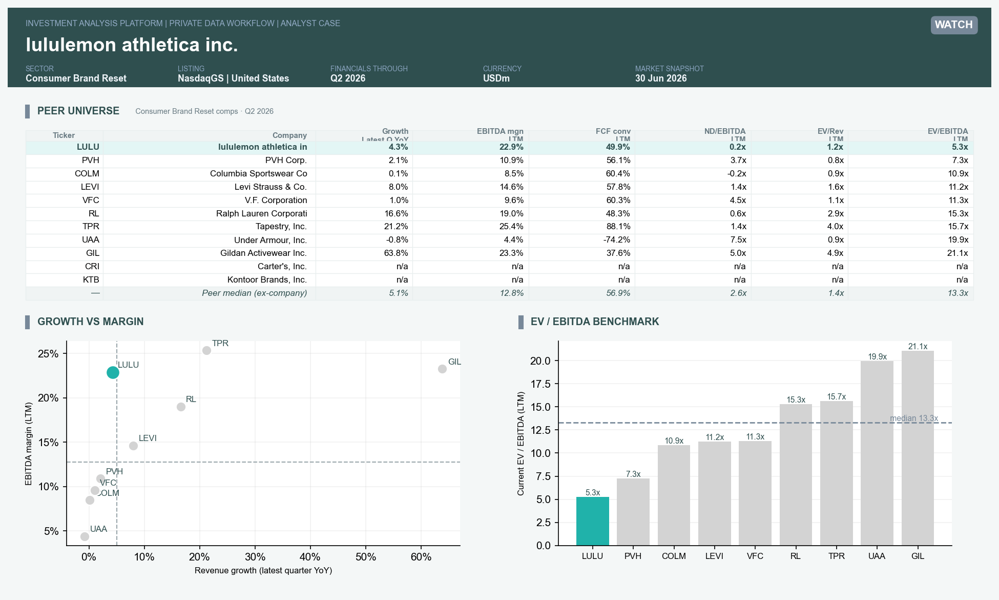 |

Os peer sets suportam três camadas de governança:

- Sugestão inicial por setor, geografia, porte e modelo de negócio.
- Aprovação ou rejeição explícita pelo analista.
- Ajustes manuais documentados, com justificativa e data de revisão.

Múltiplos negativos, denominadores não significativos e outliers extremos são sinalizados antes de entrar nas estatísticas do grupo.

## Consensus e revisão de estimativas

O módulo de expectations separa comparação contra estimativa corrente de um verdadeiro **beat/miss**. Essa linguagem só é utilizada quando existe consenso pré-resultado correspondente ao período reportado. Também são acompanhadas revisões de receita, EBITDA e EPS em 30 e 90 dias, guidance e próxima data de resultado quando os campos estão disponíveis.

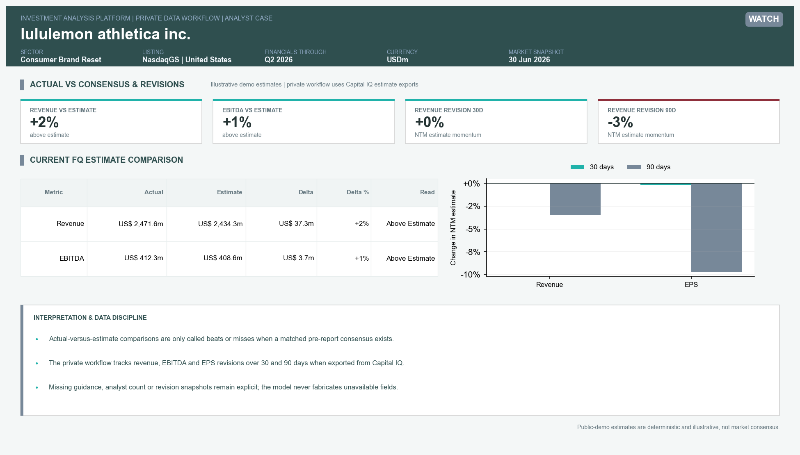

## Estrutura de capital e debt capacity

O módulo de crédito reconcilia enterprise value, calcula gross e net leverage, interest coverage e capacidade indicativa de dívida em diferentes níveis de alavancagem. Instituições financeiras são direcionadas para um framework específico de P/E, P/TBV, ROE e métricas de capital, em vez de serem forçadas em uma análise de EBITDA.

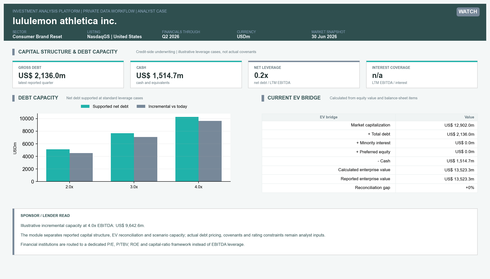

Os níveis de 2,0x, 3,0x e 4,0x são cenários analíticos. Eles não são apresentados como covenants reais sem documentação específica da companhia.

## Valuation integrado

O valuation case conecta forecast operacional, WACC, DCF, terminal value, equity bridge, cenários e perguntas de diligência. O sistema mantém separados:

- O valor intrínseco pelo método de perpetuidade.
- O cross-check por múltiplo de saída.
- A referência de trading comps.
- O histórico de negociação da própria companhia.
- A faixa de preço observada no mercado.

| Visão geral do valuation | Forecast operacional e FCF |
| --- | --- |
| 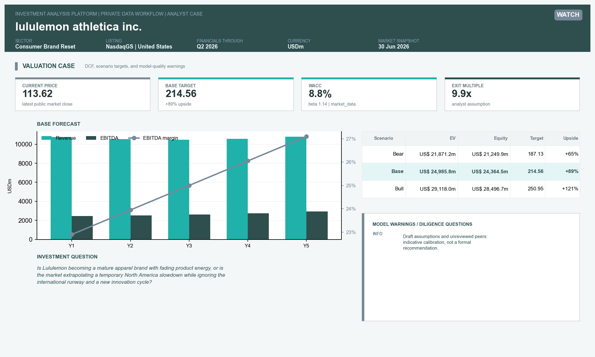 | 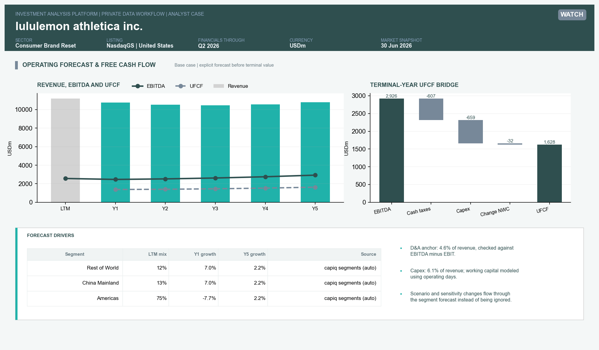 |

| Sensitivities e tornado | Terminal value e equity bridge |
| --- | --- |
| 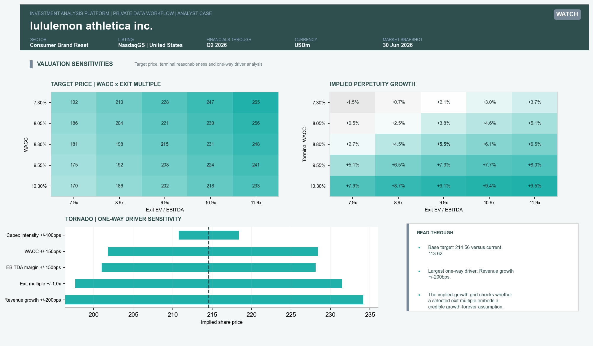 | 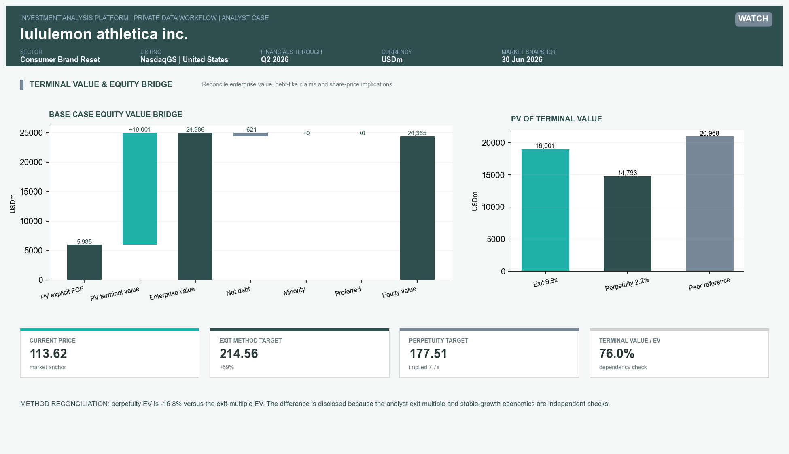 |

| WACC e proveniência das premissas | Football field |
| --- | --- |
| 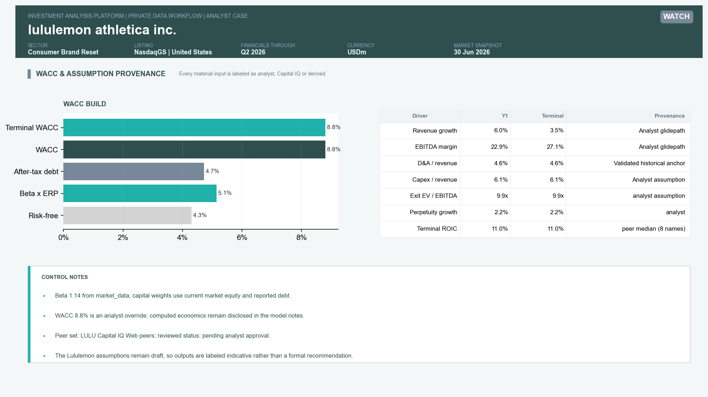 | 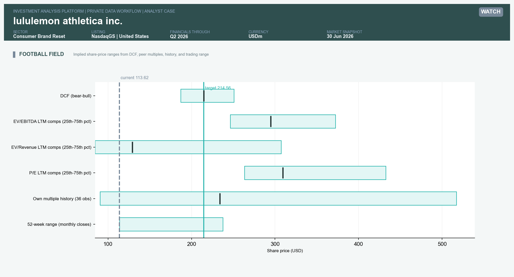 |

O modelo também testa a dependência do terminal value, a coerência entre crescimento terminal, reinvestimento e ROIC, e a distância entre métodos. Divergências relevantes não são escondidas: viram warnings e perguntas para revisão do analista.

## Múltiplos por modelo de negócio

EV/EBITDA não é tratado como resposta universal. A plataforma classifica EV/EBITDA, EV/Revenue, P/E e P/TBV como múltiplos primários, secundários, cross-checks ou não significativos conforme o business model e a qualidade do denominador.

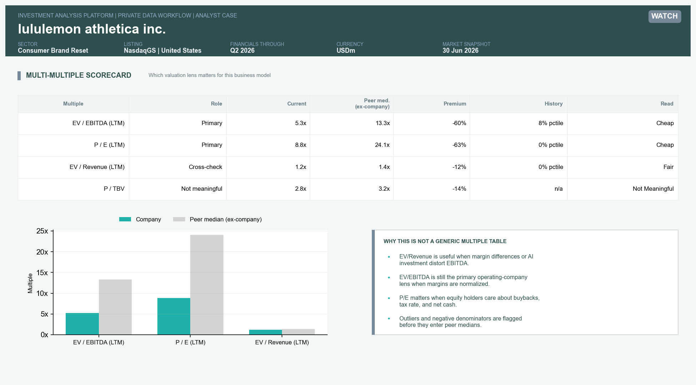

Além do snapshot atual, o sistema suporta histórico de múltiplos e comparação entre movimento da empresa e do peer group para distinguir rerating específico de mudança setorial.

## Data audit antes do valuation

O modelo não utiliza um número apenas porque ele existe na base. A camada de qualidade testa, entre outros pontos:

- Moeda e unidade.
- Market cap versus preço multiplicado por ações.
- EV bridge: market cap + debt + minority + preferred - cash.
- Sinais de CFO e capex.
- Completude do LTM.
- Períodos desatualizados.
- Duplicidade de empresa e período.
- Outliers de múltiplos.
- Consistência entre dataset e refresh log.

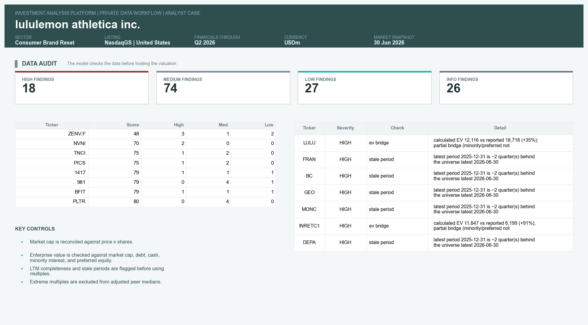

Campos ausentes permanecem como ausentes. A plataforma evita preencher artificialmente EPS, guidance, consensus histórico ou bridge items que não tenham sido exportados.

## Camada humana e IC memo

Os cálculos são automatizados; a conclusão de investimento não. O analista mantém uma camada própria com:

- Investment pillars e variant perception.
- Key debate.
- Catalisadores e riscos.
- SWOT.
- Perguntas para management.
- Premissas de forecast e valuation.
- Journal de decisões e mudanças de tese.

Essa combinação gera um memo estruturado para comitê de investimento, reunindo dados, valuation e julgamento em um único documento.

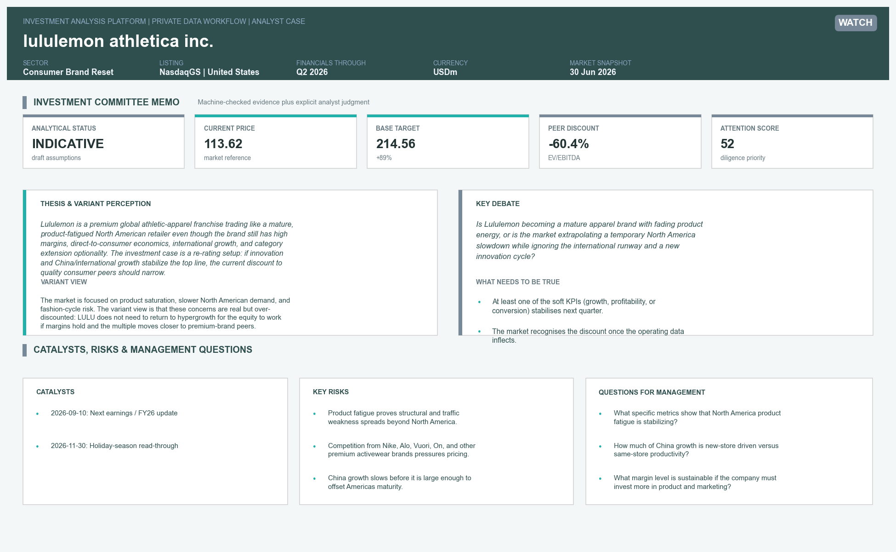

Outputs HTML da demonstração pública, mantidos separados do case privado exibido nos prints:

- [IC Memo de Alphabet](reports/sample/ic_memo_GOOGL.html)
- [Valuation Case de Alphabet](reports/sample/valuation_case_GOOGL.html)

## Arquitetura da plataforma

```text
src/
  ingestion/      loaders, schemas, universe and Capital IQ import workflow
  modeling/       metrics, peers, consensus, capital structure, DCF and safeguards
  app/            Streamlit pages and reusable interface components
  reporting/      charts, valuation cases, board packs and IC memos
  pipeline/       normalized dataset build
data/
  templates/      import and analyst-input schemas
  reference/      public reference parameters
  sample/         offline demonstration data
tests/            financial logic, data quality, privacy and application tests
```

Stack principal: **Python, pandas, Streamlit, Plotly, Matplotlib, Jinja, PowerShell, Pytest e S&P Capital IQ Pro Excel Add-In**.

## Capital IQ e confidencialidade

O ambiente privado utiliza exports do Capital IQ para financial statements, market data, estimates, valuation history e peer information. Arquivos brutos, bases tabulares derivadas, teses completas e relatórios privados permanecem em `data_private/`, fora do versionamento. O repositório contém apenas screenshots estáticos selecionados para demonstrar o workflow, sem os arquivos-fonte licenciados nem informação suficiente para reconstruir a base privada.

O repositório inclui controles específicos para evitar exposição acidental:

- Regras de `.gitignore` para exports e outputs privados.
- Testes de confidencialidade e segurança dos samples.
- Verificação de caminhos locais, marcadores privados e extensões proibidas.
- Separação explícita entre public demo e private mode.

## Executando a demonstração

<details>
<summary>Comandos</summary>

```powershell
pip install -e .
python -m src.pipeline.build_dataset --source public-demo
streamlit run src/app/streamlit_app.py -- --demo
```

Para gerar os outputs demonstrativos:

```powershell
python -m src.reporting.ic_memo --demo --company GOOGL
python -m src.reporting.valuation_case --demo --company GOOGL
python scripts/generate_sample_screenshots.py
```

Para validar a implementação:

```powershell
pytest
python scripts/check_git_hygiene.py
```

</details>

## Limitações

- A demo pública não representa consenso de mercado nem recomendação de investimento.
- A qualidade de uma análise de comps depende da revisão humana do peer set.
- Debt capacity não substitui análise de documentação, covenants, ratings e condições de mercado.
- DCF e múltiplos são ferramentas de decisão; a plataforma não elimina o risco de premissas incorretas.
- O modo completo depende de acesso autorizado ao Capital IQ e dos campos incluídos no export local.

---

Projeto desenvolvido como demonstração de análise financeira, valuation, automação e julgamento de investimento. Não constitui recomendação de compra ou venda de valores mobiliários.
