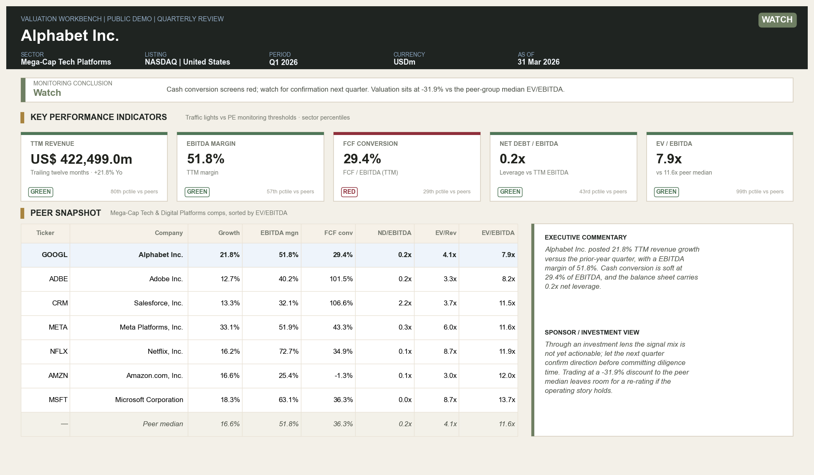
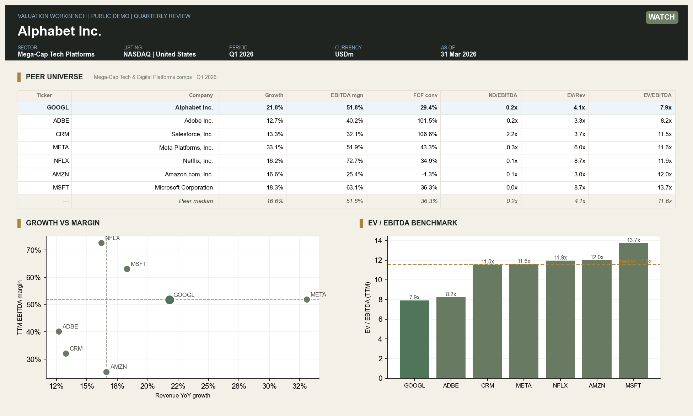
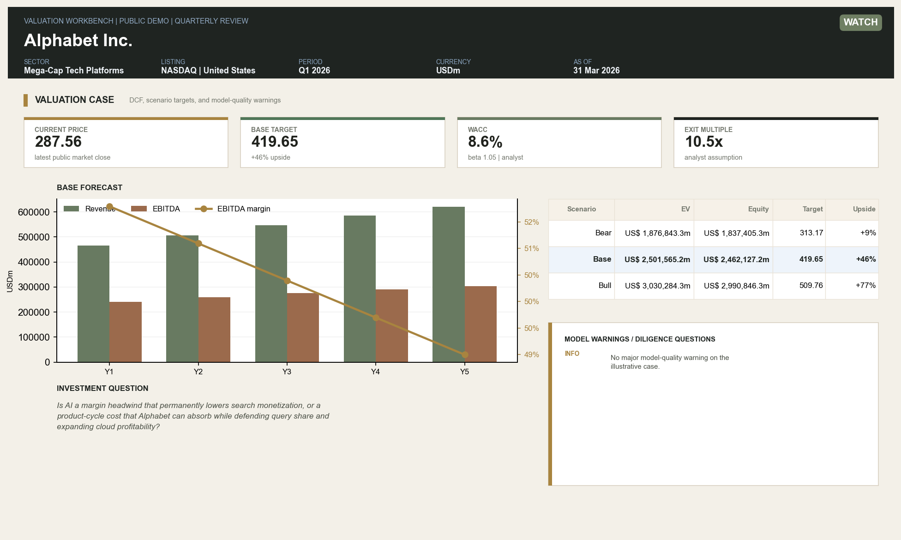
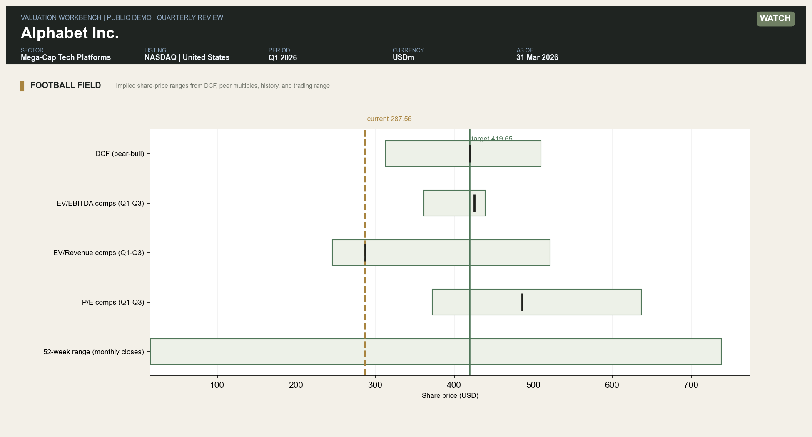
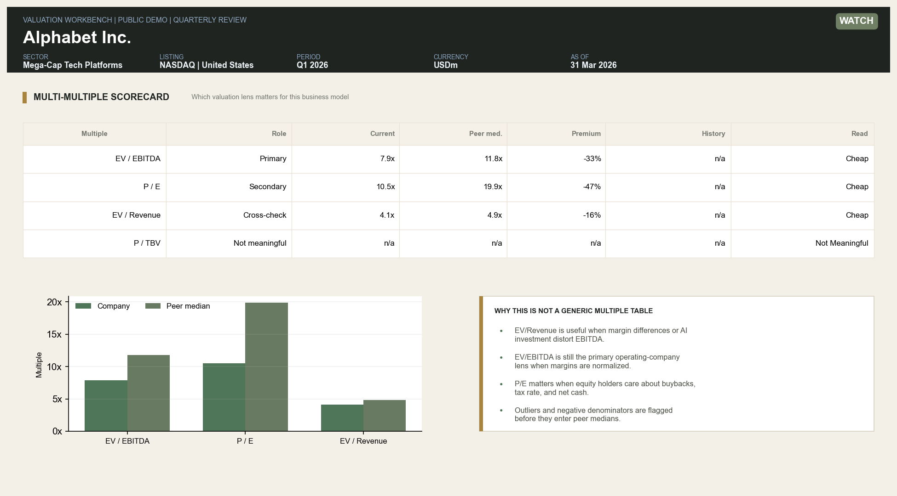
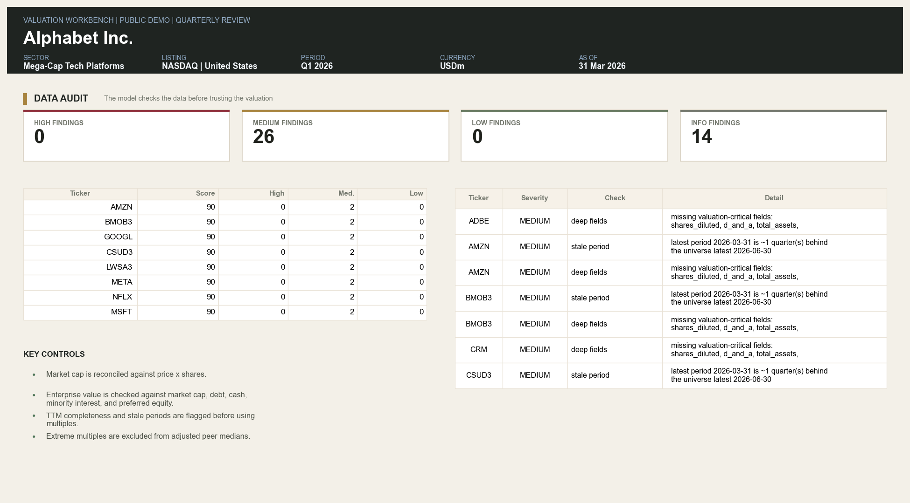

# Valuation Workbench

**Um sistema de análise de investimentos que transforma dados do Capital IQ em dashboards, valuation cases e memos de comitê de investimento.**

Este projeto foi construído para demonstrar uma combinação de finanças, dados,
automação e julgamento de investimento. A ideia é simples: em vez de analisar
uma empresa manualmente em Excel e PowerPoint do zero, o sistema cria um fluxo
repetível para monitorar companhias, validar dados, comparar pares, montar
valuation cases e gerar materiais em formato próximo ao que um time de IB, PE
ou public equities usaria internamente.

O repositório público roda com dados demonstrativos. Os dados reais do Capital IQ,
as teses privadas e a watchlist real ficam fora do GitHub em `data_private/`.
Os prints públicos usam Alphabet/Google como empresa de referência, com um peer
set de mega-cap tech reconhecível, para mostrar o produto sem expor dados
licenciados ou posições privadas.

`Python` | `Streamlit` | `Pandas` | `Plotly` | `Capital IQ Excel Add-In` | `DCF` | `Comps` | `IC Memo`

---

## Visão Geral



O sistema funciona como uma **workbench de underwriting**:

1. Puxa dados financeiros, mercado, estimativas e valuation history via Capital IQ.
2. Normaliza tudo em uma base única.
3. Calcula métricas relevantes para análise de investimento.
4. Compara cada empresa com um grupo de pares revisável.
5. Mostra alertas de qualidade de dados.
6. Constrói DCF, WACC, football field e sensibilidades.
7. Junta a camada quantitativa com uma tese escrita pelo analista.
8. Exporta materiais em formato de memo/valuation case.

O objetivo não é prever o futuro automaticamente. O objetivo é criar uma
infraestrutura que ajude o analista a pensar melhor, com dados consistentes,
premissas rastreáveis e uma narrativa de investimento clara.

## Por Que Este Projeto É Relevante

Este não é um dashboard genérico de ações. O projeto tenta responder perguntas
que aparecem em processos reais de investimento:

- A empresa está barata ou o múltiplo baixo é justificado?
- O crescimento está acelerando ou desacelerando?
- As margens são estruturalmente superiores aos pares?
- O mercado está revisando estimativas para cima ou para baixo?
- O valuation atual exige premissas agressivas demais?
- O balanço permite alavancagem ou limita a tese?
- O peer group faz sentido ou distorce a conclusão?
- Quais perguntas eu faria para management antes de defender a tese?

## Principais Funcionalidades

### 1. Watchlist e Priorização

Ranking das empresas por atenção analítica: valuation vs histórico, momentum de
estimativas, performance operacional, qualidade de dados e flags de risco.

### 2. Peer Benchmarking



Compara a empresa contra pares por crescimento, margens, múltiplos e percentis.
O sistema separa **tema de investimento** de **trading comps**, evitando que uma
tese interessante use pares errados.

### 3. Valuation Case



Gera um case de valuation com:

- Forecast operacional.
- WACC.
- DCF.
- Valor terminal por múltiplo de saída e perpetuidade.
- Equity bridge.
- Sensibilidade de WACC x múltiplo.
- Cenários bear/base/bull.
- Proveniência das premissas.

### 4. Football Field



Visualiza faixas de preço implícito por DCF, múltiplos de mercado, histórico da
própria empresa e faixa de negociação.

### 5. Multi-Multiple Scorecard



O sistema não força todas as empresas no mesmo framework. Dependendo do modelo
de negócio, múltiplos como EV/EBITDA, EV/Revenue, P/E e P/TBV podem ser
classificados como primários, secundários, cross-check ou não significativos.

### 6. Data Audit



Antes de confiar na análise, o sistema testa a base:

- Erros de unidade ou moeda.
- Market cap vs preço x ações.
- Ponte de enterprise value.
- Sinais incorretos em CFO/capex.
- TTM incompleto.
- Dados stale.
- Outliers em múltiplos.
- Inconsistência no refresh log.

### 7. Tese do Analista

A parte mais importante do projeto é a separação entre:

**Camada de máquina**

- Dados financeiros.
- Estimativas.
- Múltiplos.
- Peer benchmarking.
- Data audit.
- Valuation.
- Gráficos.

**Camada humana**

- Tese de investimento.
- Variant perception.
- Key debate.
- Investment pillars.
- SWOT.
- Catalysts.
- Risks.
- Perguntas para management.
- Journal de decisões.

Essa camada fica em arquivos YAML privados dentro de `data_private/theses/`.
Assim, o sistema consegue transformar uma tese construída em Excel/PowerPoint em
um memo estruturado e reutilizável.

## Estrutura Recomendada Do Repositório

Esta é a estrutura que deve aparecer no GitHub:

```text
portfolio-company-monitoring-dashboard/
  .github/
    workflows/
      tests.yml
  data/
    reference/
    sample/
      assumptions/
      public_demo/
      theses/
    templates/
  docs/
    capital_iq_import_guide.md
    data_dictionary.md
    github_portfolio_strategy.md
    guia_publicacao_github.md
    methodology.md
  reports/
    sample/
      01_watchlist_home.png
      02_peer_benchmarking.png
      03_valuation_case.png
      04_football_field.png
      05_multiples_scorecard.png
      06_data_audit.png
      ic_memo_GOOGL.html
      valuation_case_GOOGL.html
  scripts/
  src/
  tests/
  .gitattributes
  .gitignore
  LICENSE
  README.md
  pyproject.toml
  requirements.txt
```

## O Que Subir Para O GitHub

Suba:

- `src/`
- `scripts/`
- `tests/`
- `.github/`
- `data/reference/`
- `data/sample/`
- `data/templates/`
- `docs/`, exceto `docs/archive/`
- `reports/sample/`
- `.gitignore`
- `.gitattributes`
- `README.md`
- `LICENSE`
- `requirements.txt`
- `pyproject.toml`

Não suba:

- `data_private/`
- `data/processed/`
- `reports/private/`
- `tmp/`
- `.venv/`
- `.pytest_cache/`
- `.ruff_cache/`
- `.streamlit/secrets.toml`
- Arquivos `.xlsb`, exports brutos do Capital IQ ou planilhas privadas.
- Decks originais com dados do Capital IQ.
- Screenshots privados com tickers, pares ou números licenciados.

## Como Rodar A Demo Pública

```powershell
pip install -e .

python -m src.pipeline.build_dataset --source public-demo
streamlit run src/app/streamlit_app.py -- --demo

python -m src.reporting.ic_memo --demo --company GOOGL
python -m src.reporting.valuation_case --demo --company GOOGL
pytest
```

## Como Rodar Com Capital IQ Local

Este modo exige Excel com o S&P Capital IQ Pro Add-In logado.

```powershell
powershell -ExecutionPolicy Bypass -File scripts\export_capiq_watchlist.ps1

python -m src.pipeline.build_dataset `
  --source capiq `
  --input data_private/capiq_exports `
  --output data_private/processed/monitoring_dataset.csv

streamlit run src/app/streamlit_app.py
```

Os dados licenciados ficam somente em:

```text
data_private/
```

## Segurança E Confidencialidade

Este projeto foi estruturado para ser demonstrável sem expor dados privados.

Antes de publicar:

```powershell
git status --short
git check-ignore data_private/theses/exemplo.yaml
git check-ignore data_private/reports/exemplo.html
python scripts/check_git_hygiene.py
pytest tests/test_confidentiality.py tests/test_sample_outputs_safety.py
```

O repositório público deve mostrar o sistema, a metodologia e a demo. Ele não
deve mostrar sua watchlist real, teses completas de empresas reais, exports do
Capital IQ ou relatórios privados.

## Stack Técnica

- Python
- Pandas
- Streamlit
- Plotly
- Jinja
- PowerShell
- S&P Capital IQ Excel Add-In
- Pytest

## O Que Este Projeto Demonstra

Para recrutamento em Private Equity, Investment Banking ou public equities, este
projeto demonstra que eu consigo:

- Trabalhar com dados financeiros institucionais.
- Automatizar processos manuais de análise.
- Construir análises de valuation com DCF e comps.
- Separar dados, premissas e julgamento humano.
- Tratar confidencialidade de dados licenciados.
- Criar materiais parecidos com outputs reais de investimento.
- Comunicar uma tese em formato de memo.

## Como Eu Descreveria No CV

> Desenvolvi uma valuation workbench em Python integrada ao Capital IQ, capaz de
> transformar exports financeiros, peer sets, estimativas e teses escritas pelo
> analista em dashboards de monitoramento, análises de comps, DCF, football
> field, data audit e memos de comitê de investimento. O projeto inclui demo
> pública sem dados licenciados e arquitetura privada para proteger informações
> do Capital IQ.

## Status

- Demo pública funcional.
- Fluxo privado com Capital IQ local.
- Testes automatizados.
- Sample reports e screenshots públicos.
- Camada privada para teses e premissas por empresa.

Este projeto é apenas uma demonstração educacional e de portfólio. Não é
recomendação de investimento.
