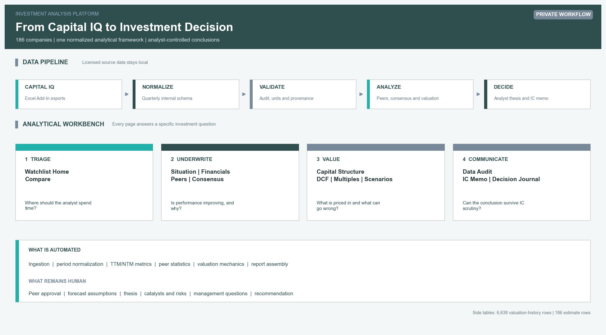
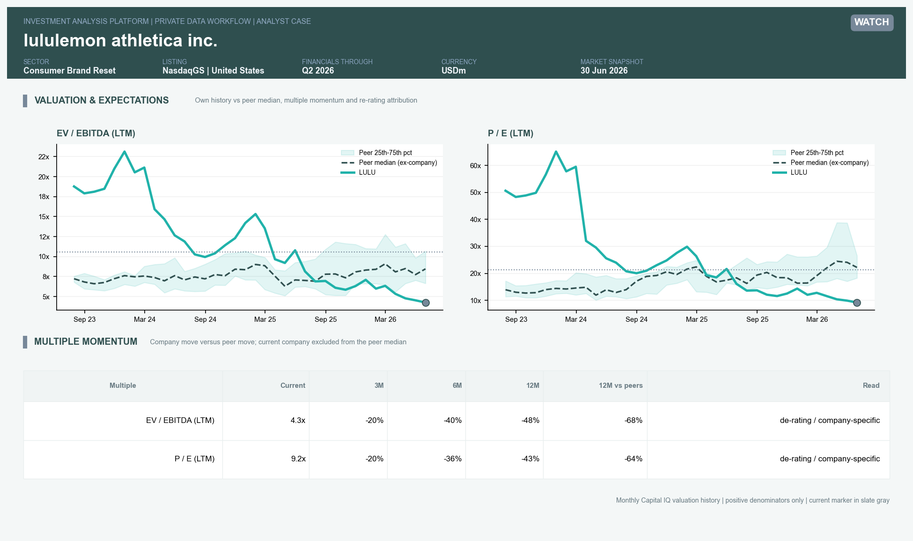
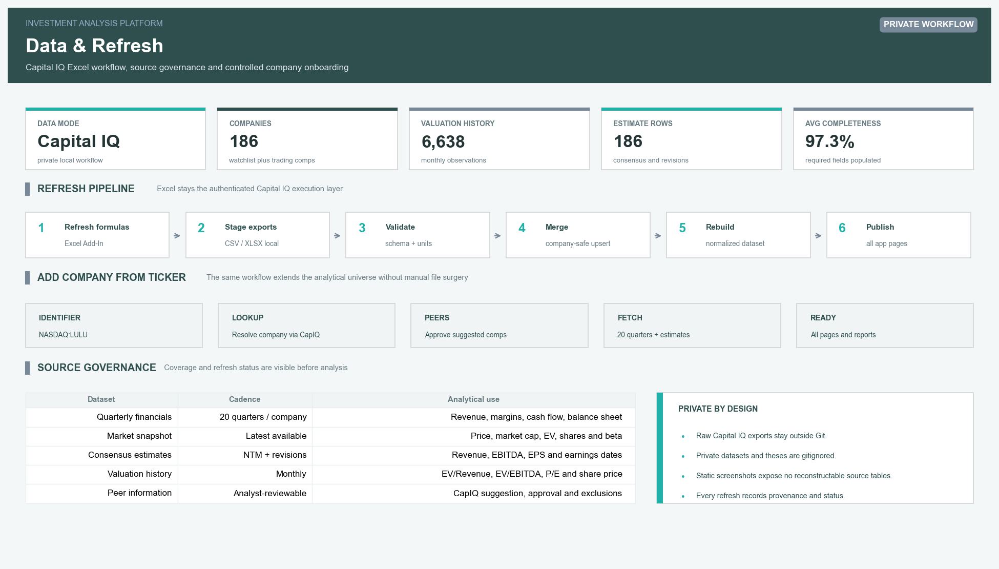

# Investment Analysis Platform

**Plataforma de análise de investimentos que transforma exports locais do S&P Capital IQ Pro em screening, acompanhamento financeiro, análise de peers, valuation e materiais para comitê de investimento.**

O ambiente ilustrado abaixo possui **186 companhias**, entre empresas monitoradas e trading comps, com cobertura no Brasil e nos Estados Unidos. A mesma estrutura analítica pode ser aplicada a qualquer companhia adicionada ao universo. A **Lululemon** é utilizada como case demonstrativo do fluxo completo.

[](reports/sample/00_how_it_works.png)

> Clique em qualquer imagem para abrir em resolução completa. Os outputs são indicativos, as premissas da Lululemon permanecem identificadas como draft e o material não constitui recomendação de investimento.

## Todas as páginas da plataforma

### Cobertura e priorização

| Watchlist Home | Compare |
| --- | --- |
| [](reports/sample/01_watchlist_overview.png) | [](reports/sample/04_compare_companies.png) |
| Ranking de atenção para decidir onde concentrar diligência. | Comparação lado a lado de performance, valuation e revisões. |

### Análise da companhia

| Company Situation | Company Financials |
| --- | --- |
| [](reports/sample/02_company_situation.png) | [](reports/sample/03_company_financials.png) |
| KPIs, sinais de atenção, leitura de investimento e posição relativa. | Histórico trimestral, LTM, margens, cash flow e valuation corrente. |

### Peers e expectativas

| Peer Benchmarking | Actual vs Consensus |
| --- | --- |
| [](reports/sample/05_peer_benchmarking.png) | [](reports/sample/06_actual_vs_consensus.png) |
| Comp set, medianas ex-company, growth versus margin e múltiplos. | Performance contra estimativas e revisões de 30 e 90 dias. |

### Capital e valor intrínseco

| Capital Structure | Valuation Case |
| --- | --- |
| [](reports/sample/07_capital_structure.png) | [](reports/sample/08_valuation_case.png) |
| EV bridge, leverage, liquidez, interest coverage e debt capacity. | DCF, cenários, terminal value, cross-checks e model warnings. |

### Mercado e decisão

| Valuation & Expectations | IC Memo Export |
| --- | --- |
| [](reports/sample/18_multiples_history.png) | [](reports/sample/16_ic_memo.png) |
| EV/EBITDA e P/E históricos, peer bands e momentum relativo. | Dados, valuation, tese, riscos, catalisadores e perguntas para management. |

### Governança analítica

| Data Audit | Data & Refresh |
| --- | --- |
| [](reports/sample/15_data_audit.png) | [](reports/sample/17_data_refresh.png) |
| Validação de moeda, unidades, TTM, EV bridge, sinais e stale periods. | Capital IQ Excel workflow, proveniência, refresh e inclusão por ticker. |

## Valuation em profundidade

O valuation não termina em um único target price. A plataforma mostra como o valor foi construído, quais premissas mais importam e onde diferentes métodos divergem.

| Forecast operacional e FCF | DCF sensitivities e tornado |
| --- | --- |
| [](reports/sample/09_operating_forecast.png) | [](reports/sample/10_dcf_sensitivity.png) |

| Terminal value e equity bridge | WACC e proveniência das premissas |
| --- | --- |
| [](reports/sample/11_terminal_value_bridges.png) | [](reports/sample/12_wacc_assumptions.png) |

| Football field | Multi-multiple scorecard |
| --- | --- |
| [](reports/sample/13_football_field.png) | [](reports/sample/14_multiples_scorecard.png) |

No case demonstrativo, a Lululemon apresenta preço de referência de **US$ 113,62**, WACC de **8,8%**, exit multiple de **9,9x** e valor indicativo base de **US$ 214,56**. A diferença entre exit multiple e perpetuity growth permanece visível como warning, em vez de ser escondida pelo modelo.

## O que a plataforma automatiza

- Importação e normalização de financials trimestrais, market data, estimates e valuation history.
- TTM/NTM, crescimento, margens, cash conversion, leverage, ROIC/ROE e múltiplos.
- Peer statistics com a companhia analisada excluída da mediana.
- DCF, WACC, sensitivities, football field, debt capacity e report assembly.
- Data audit, proveniência e controles contra campos incorretos ou incompletos.

## Onde o analista interfere

- Aprovação, rejeição e justificativa dos peers.
- Premissas operacionais, WACC, terminal value e cenários.
- Tese, variant perception, catalisadores, riscos e perguntas para management.
- Interpretação dos resultados e recomendação final.

## Capital IQ e confidencialidade

Arquivos brutos, bases tabulares derivadas, teses completas e relatórios privados permanecem em `data_private/`, fora do versionamento. O repositório contém apenas screenshots estáticos selecionados, sem os arquivos-fonte licenciados nem informação suficiente para reconstruir a base privada.

<details>
<summary><strong>Arquitetura e stack</strong></summary>

```text
src/
  ingestion/      loaders, schemas, universe and Capital IQ import workflow
  modeling/       metrics, peers, consensus, capital structure, DCF and safeguards
  app/            Streamlit pages and reusable interface components
  reporting/      charts, valuation cases, board packs and IC memos
  pipeline/       normalized dataset build
data/
  templates/      import and analyst-input schemas
  reference/      public reference parameters
  sample/         offline demonstration data
tests/            financial logic, data quality, privacy and application tests
```

Stack principal: **Python, pandas, Streamlit, Plotly, Matplotlib, Jinja, PowerShell, Pytest e S&P Capital IQ Pro Excel Add-In**.

</details>

<details>
<summary><strong>Executando a demonstração</strong></summary>

```powershell
pip install -e .
python -m src.pipeline.build_dataset --source public-demo
streamlit run src/app/streamlit_app.py -- --demo
```

Para gerar os outputs e validar o projeto:

```powershell
python scripts/generate_sample_screenshots.py
pytest
python scripts/check_git_hygiene.py
```

Outputs HTML da demonstração pública:

- [IC Memo de Alphabet](reports/sample/ic_memo_GOOGL.html)
- [Valuation Case de Alphabet](reports/sample/valuation_case_GOOGL.html)

</details>

<details>
<summary><strong>Limitações</strong></summary>

- A qualidade de uma análise de comps depende da revisão humana do peer set.
- Debt capacity não substitui documentação de dívida, covenants, ratings e condições de mercado.
- DCF e múltiplos dependem da qualidade das premissas e não eliminam risco de modelagem.
- O modo completo depende de acesso autorizado ao Capital IQ e dos campos incluídos no export local.

</details>

---

Projeto desenvolvido como demonstração de análise financeira, valuation, automação e julgamento de investimento. Não constitui recomendação de compra ou venda de valores mobiliários.
