# Investment Analysis

**Plataforma de análise de investimentos que transforma exports locais do S&P Capital IQ Pro em screening, acompanhamento financeiro, análise de peers, valuation e materiais para comitê de investimento.**

O ambiente demonstrado possui **26 companhias monitoradas e 160 trading comps**, totalizando **186 nomes** com cobertura no Brasil e nos Estados Unidos. Qualquer empresa pode ser adicionada desde que seus dados estejam disponíveis no S&P Capital IQ Pro (a plataforma é alimentada por exports gerados por meio do meu acesso licenciado ao sistema). A mesma arquitetura analítica pode ser aplicada a qualquer companhia adicionada ao universo. A **Lululemon** é utilizada abaixo como case demonstrativo do fluxo completo, pois é uma empresa que acompanho e para a qual desenvolvi manualmente uma tese de investimento.

> Clique em qualquer imagem para abrir em resolução completa. A galeria foi atualizada em agosto de 2026 e cobre as páginas analíticas, os principais gráficos, o modelo de drivers e o editor de premissas. O case da Lululemon utiliza premissas finais revisadas manualmente e um peer set aprovado; os outputs continuam indicativos e não constituem recomendação de investimento.

## Da watchlist à decisão

| Watchlist priorizada | Comparação no fluxo de peers |
| --- | --- |
| [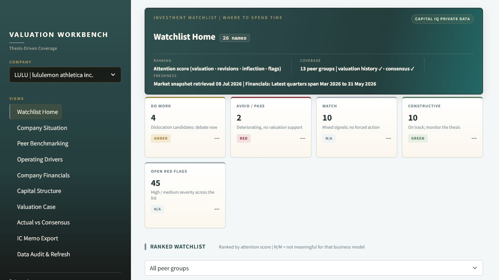](reports/sample/browser/current/01_watchlist_home.jpg) | [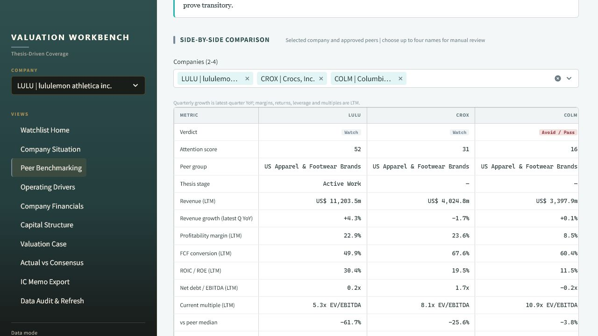](reports/sample/browser/current/02_compare.jpg) |
| Ranking de atenção combina valuation, revisões, inflexão operacional e red flags para direcionar a revisão humana. | O Peer Benchmarking termina com a comparação lado a lado de Lululemon, Crocs e Columbia, reunindo performance, valuation, revisões e racional de priorização. |

## Leitura da companhia e tese

| Monitoramento trimestral | Tese construída manualmente |
| --- | --- |
| [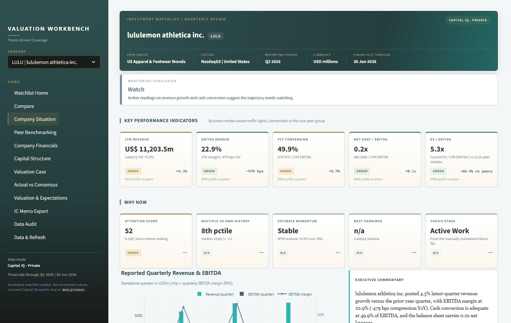](reports/sample/browser/current/03_company_situation.png) | [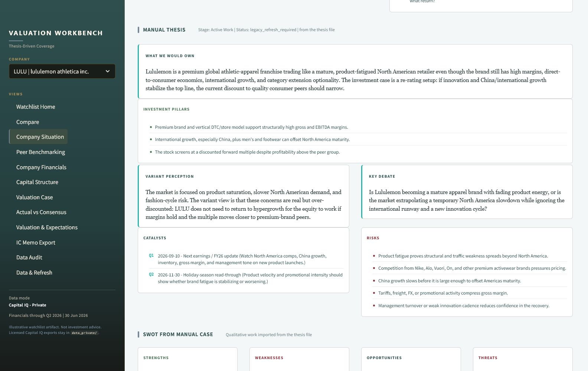](reports/sample/browser/current/03b_manual_thesis.png) |
| KPIs, sinais de atenção, leitura executiva, red flags e perguntas para management. | What we would own, pilares, variant perception, debate central, catalisadores, riscos, SWOT e diligence questions. |

## Comparable companies

| Comparable Companies e estatísticas |
| --- | --- |
| [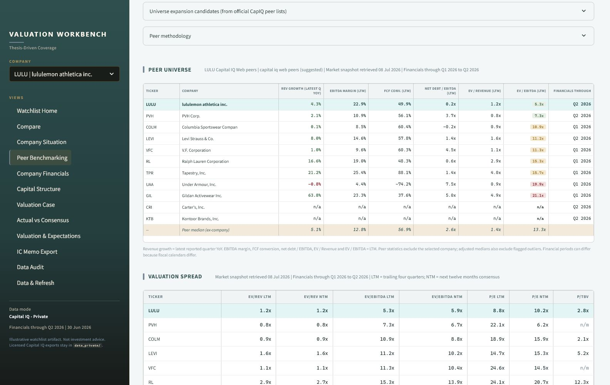](reports/sample/browser/current/04_peer_universe.png) | [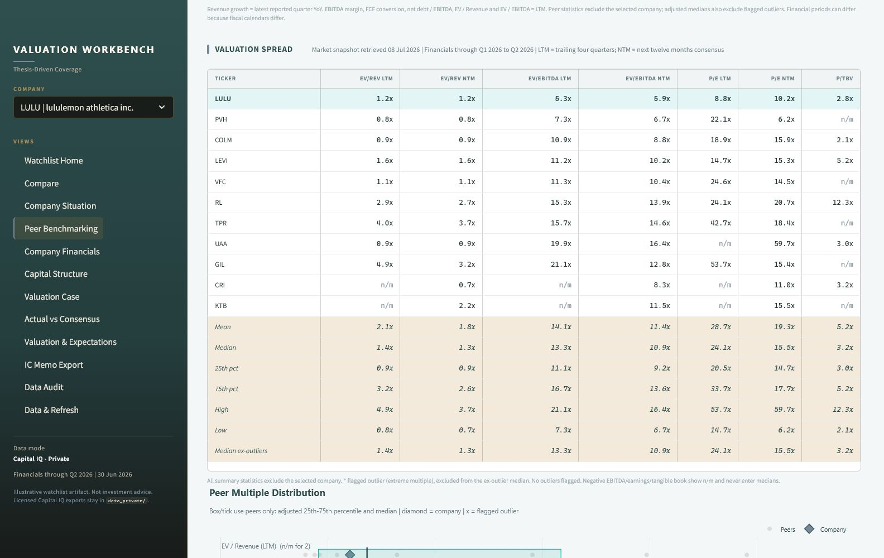](reports/sample/browser/current/04b_valuation_spread.png) |
| Peers sugeridos pelo Capital IQ, revisão humana, rejeições documentadas e mediana ex-company. | EV/Revenue, EV/EBITDA, P/E e P/TBV em LTM/NTM, com mean, median, quartis, high/low e tratamento de outliers. |

| Posicionamento fundamental | Actual vs consensus |
| --- | --- |
| [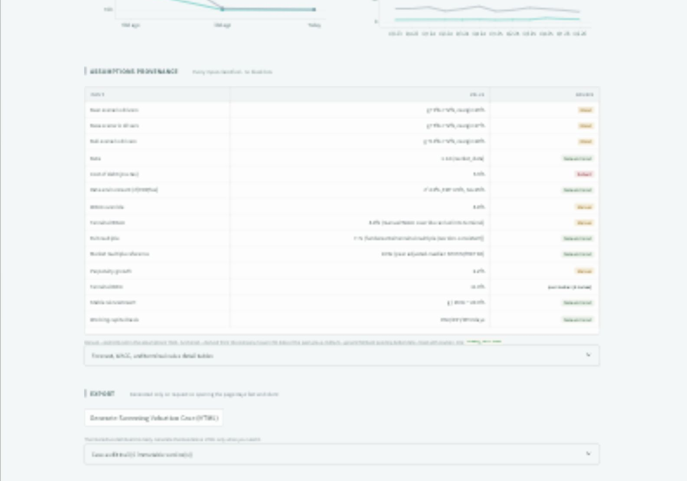](reports/sample/browser/current/04d_peer_positioning.png) | [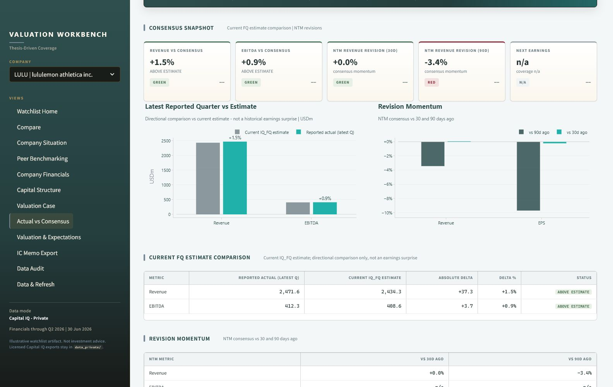](reports/sample/browser/current/07_actual_vs_consensus.png) |
| Crescimento, margem, ROE e múltiplos mostram se o valuation relativo é sustentado pelos fundamentos. | Receita e EBITDA contra estimativas, além de revisões de receita e EPS em 30 e 90 dias. |

[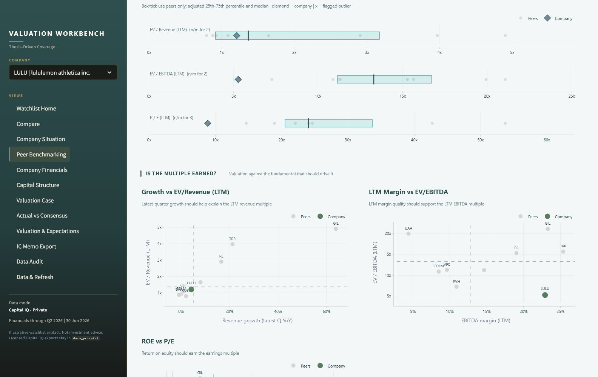](reports/sample/browser/current/04c_multiple_earned.png)

Os gráficos de `growth vs. EV/Revenue`, `margin vs. EV/EBITDA` e `ROE vs. P/E` testam visualmente se o prêmio ou desconto da companhia é sustentado pelos fundamentos.

## Drivers operacionais e projeção de receita

| Histórico físico e por canal | Receita projetada pelos drivers |
| --- | --- |
| [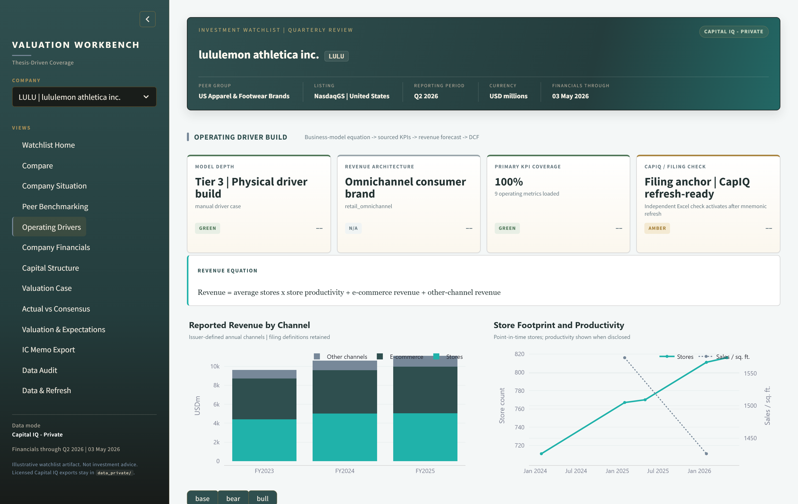](reports/sample/browser/current/04e_operating_driver_history.png) | [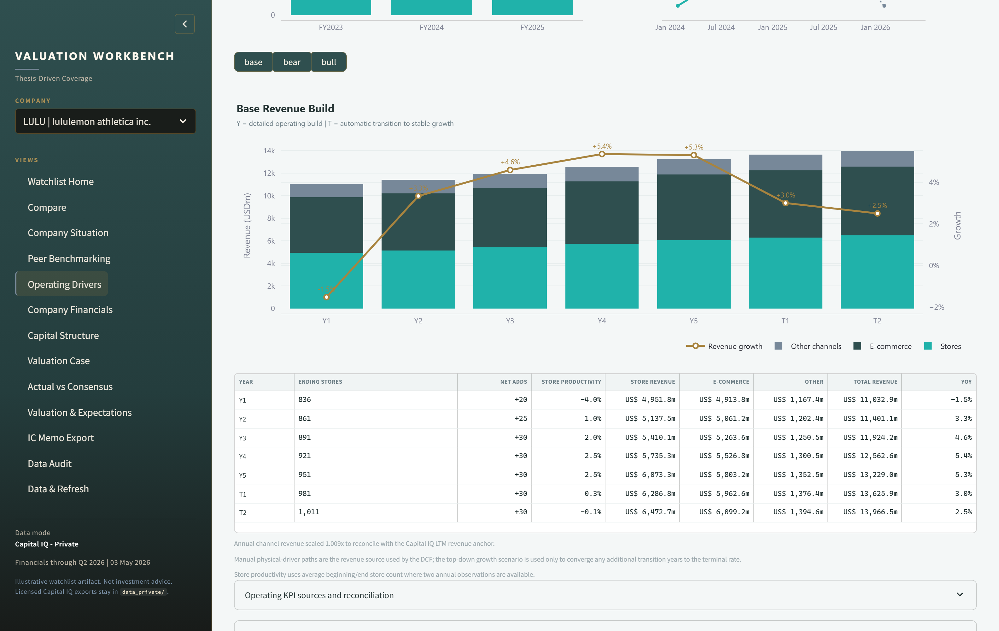](reports/sample/browser/current/04f_operating_driver_projection.png) |
| Receita de lojas, e-commerce e outros canais é conciliada com o total; lojas e vendas por pé quadrado preservam a definição do filing. | Lojas médias, net store additions, produtividade, e-commerce e outros canais determinam a receita usada pelo DCF em Base, Bear e Bull. |

Cada uma das **26 empresas monitoradas** possui uma arquitetura de receita
explícita: lojas e produtividade, membros e clubes, frota e utilização,
backlog e conversão, clientes e receita recorrente, volume e ASP, TPV e take
rate, entre outras. O sistema usa três níveis de profundidade, sem inventar
dados ausentes: **Tier 3** para KPIs físicos, **Tier 2** para segmentos
reportados e **Tier 1** para crescimento consolidado revisado. A própria página
mostra a cobertura e os campos necessários no próximo refresh do Excel.

[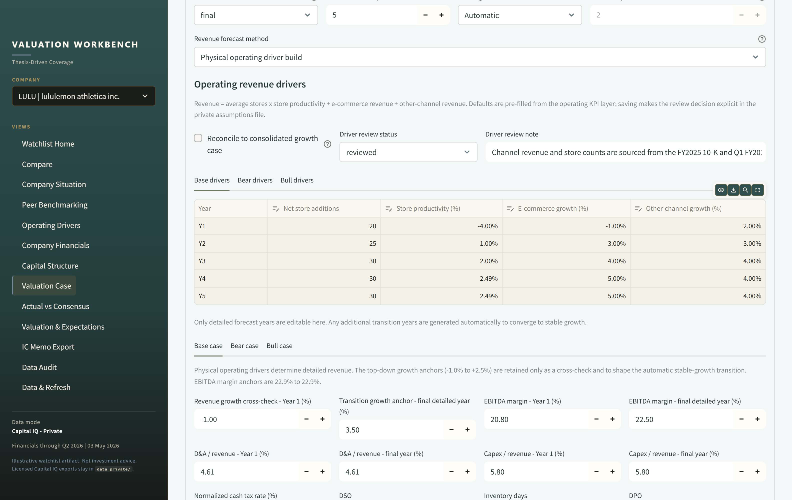](reports/sample/browser/current/08j_operating_driver_assumptions.png)

Os inputs físicos são pré-preenchidos e editáveis. Quando um case manual é
salvo, os drivers operacionais passam a ser a fonte da projeção de receita e
alimentam o mesmo DCF, sensitivities, sponsor-return screen e materiais de
comitê. Capital IQ e filings permanecem como observações separadas; diferenças
superiores a 1% são destacadas para investigação.

## Financials e estrutura de capital

| Demonstrações e KPIs | Cash flow, capital efficiency e leverage |
| --- | --- |
| [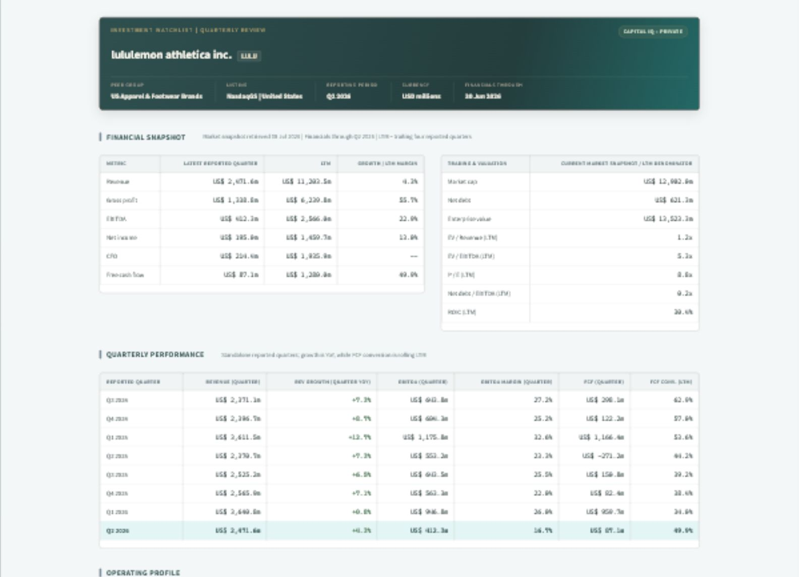](reports/sample/browser/current/05_financial_snapshot.png) | [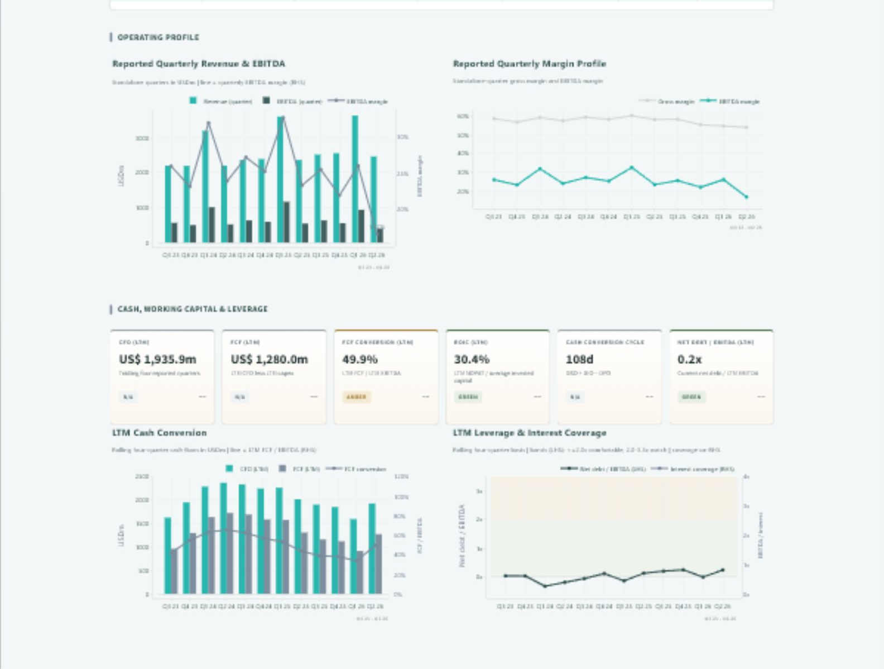](reports/sample/browser/current/05b_financial_charts.png) |
| Histórico trimestral, LTM, crescimento, margens, market cap, EV, múltiplos e ROIC. | Receita, EBITDA, gross margin, FCF conversion, cash conversion cycle e net leverage. |

[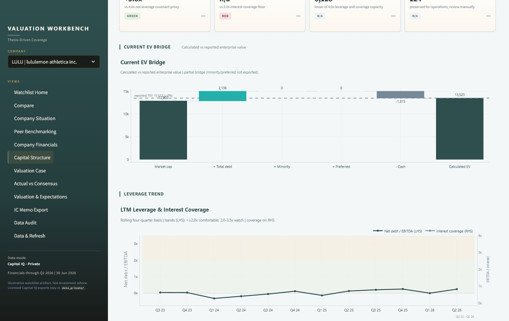](reports/sample/browser/current/06_capital_structure.png)

O módulo de capital structure reconcilia market cap, dívida e caixa até o enterprise value, calcula leverage e coverage e testa debt capacity em diferentes níveis de dívida/EBITDA.

## Valuation em profundidade

| Visão executiva do case | Editor de premissas |
| --- | --- |
| [](reports/sample/browser/current/08_valuation_case_top.png) | [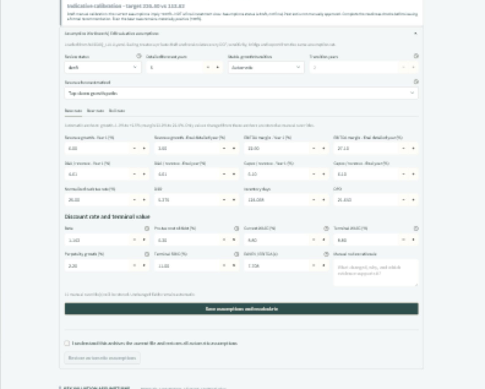](reports/sample/browser/current/08_assumption_workbench.png) |
| Preço atual, target revisado, WACC, terminal multiple e status de revisão no primeiro bloco. | Base, Bear e Bull começam preenchidos pelos anchors automáticos e podem ser ajustados manualmente. |

O **Assumption tab** permite editar Base, Bear e Bull diretamente na
plataforma. Todo campo abre preenchido com o valor automático vigente; somente
as alterações feitas manualmente são gravadas como overrides. O salvamento
recalcula DCF, sensitivities, bridges, sponsor returns e exports a partir da
mesma fonte, arquiva a versão anterior e mantém a trilha de mudanças em
`data_private/`, fora do Git.

| Drivers operacionais editáveis | WACC e premissas terminais |
| --- | --- |
| [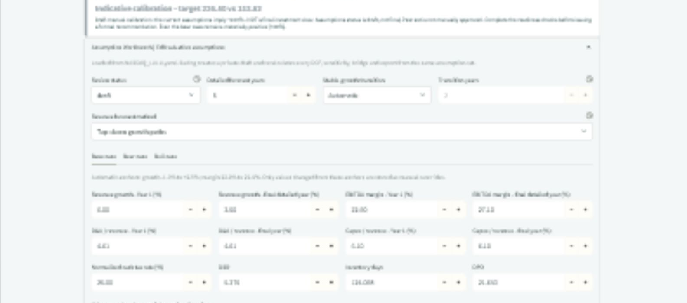](reports/sample/browser/current/08h_assumption_drivers.png) | [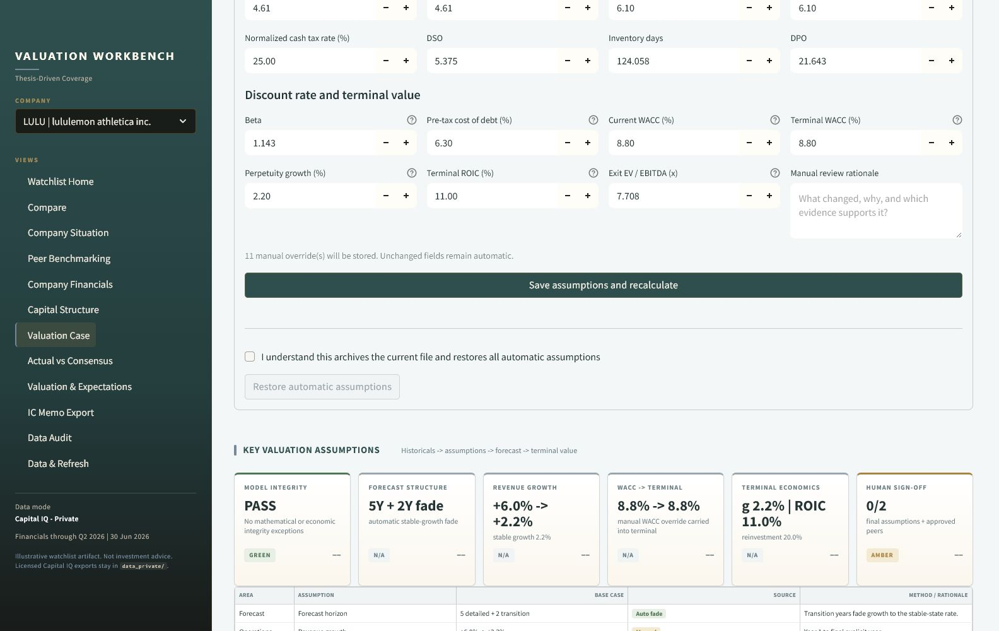](reports/sample/browser/current/08i_assumption_terminal.png) |
| Crescimento, margem, D&A, capex, tax rate e working capital por cenário. | Beta, custo da dívida, WACC, crescimento perpétuo, ROIC terminal e exit multiple. |

[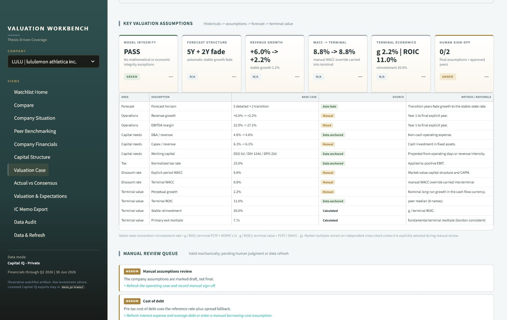](reports/sample/browser/current/08a_key_assumptions.png)

As premissas ficam visíveis antes dos outputs: horizonte detalhado e fade, crescimento, margem, D&A, capex, working capital, tax rate, WACC, crescimento perpétuo, ROIC terminal e reinvestimento. Cada input é classificado como `manual`, `data anchored`, `mixed` ou `calculated`.

[](reports/sample/browser/current/08a_key_assumptions.png)

O sistema separa erro de modelo de julgamento pendente. A recomendação só pode se tornar final após aprovação das premissas e dos peers. Cross-checks interpretativos podem ser encerrados apenas com uma justificativa manual registrada; falhas de dados, prontidão ou integridade matemática nunca podem ser dispensadas dessa forma.

| Cenários e matriz WACC × múltiplo | Tornado e crescimento perpétuo implícito |
| --- | --- |
| [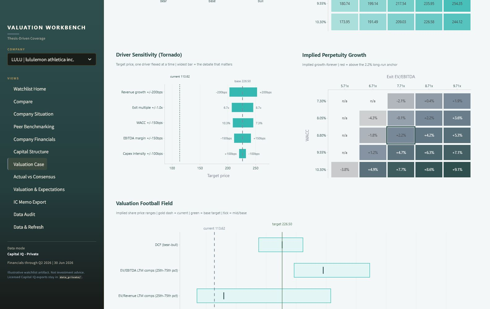](reports/sample/browser/current/08b_valuation_range.png) | [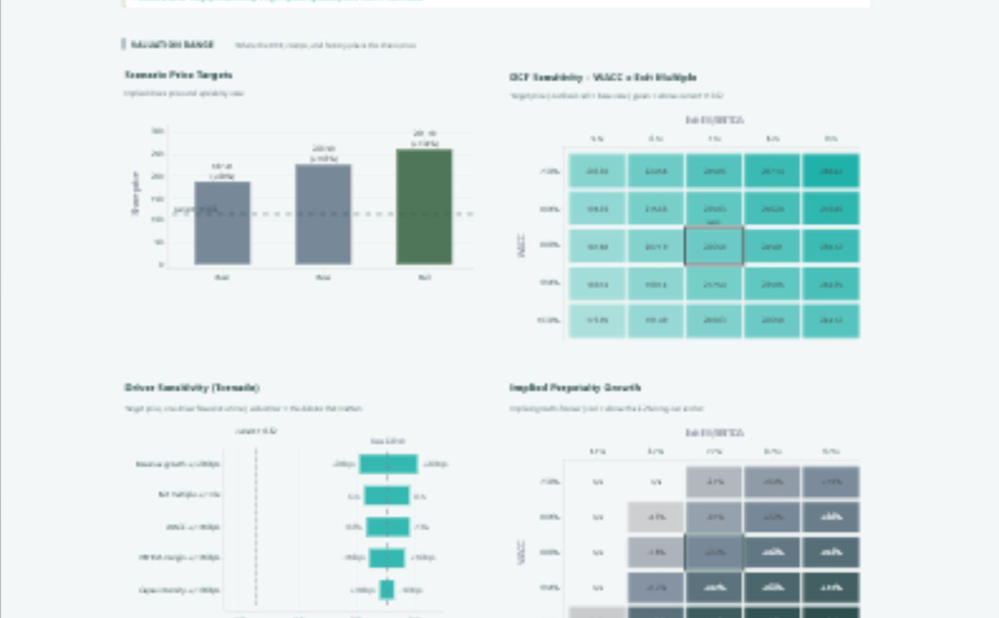](reports/sample/browser/current/08b1_sensitivity_matrix.png) |
| Bear, Base e Bull contra o preço atual, com a célula-base destacada. | Receita, margem, WACC, capex e exit multiple testados isoladamente; o modelo também traduz o múltiplo em crescimento implícito. |

[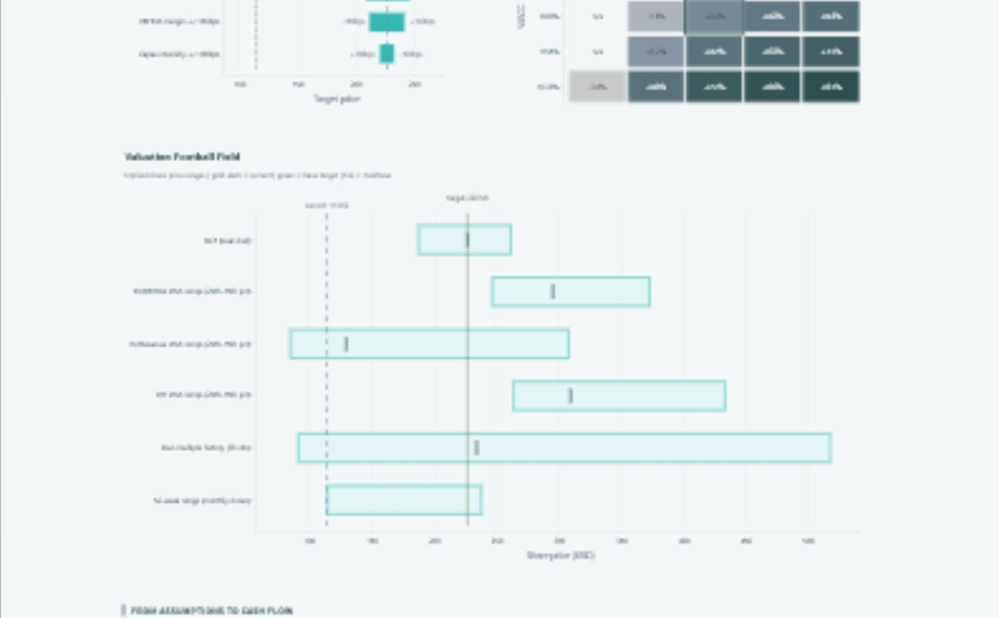](reports/sample/browser/current/08b2_range_detail.png)

O football field triangula DCF, EV/EBITDA, EV/Revenue, P/E, histórico próprio e faixa de 52 semanas, mantendo o target e o preço atual como referências separadas.

| Forecast operacional e UFCF | Equity value e enterprise value bridges |
| --- | --- |
| [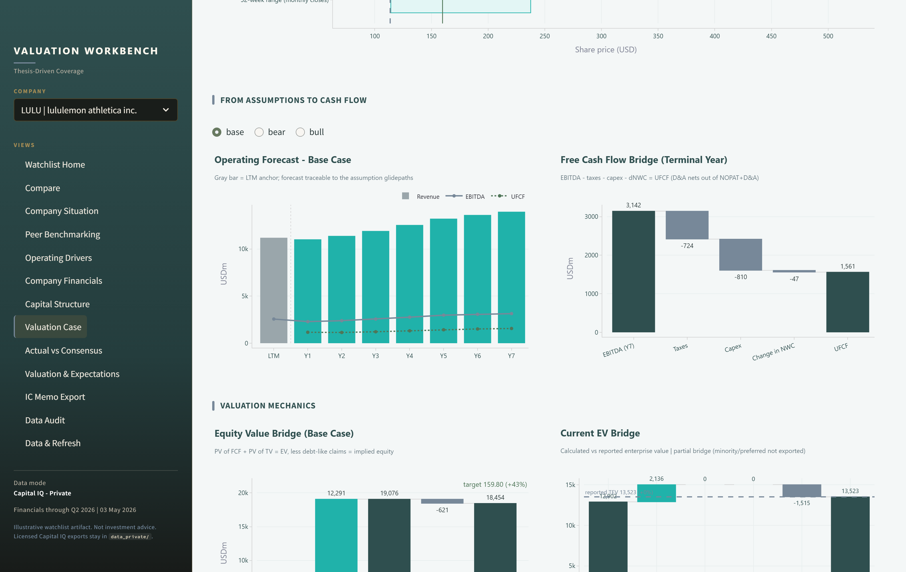](reports/sample/browser/current/08c_forecast_and_fcf.png) | [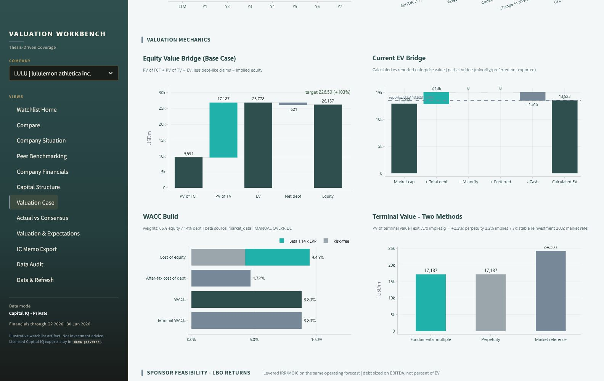](reports/sample/browser/current/08d_valuation_mechanics.png) |
| Forecast com período detalhado e fade explícito até o steady state; EBITDA é convertido em UFCF. | O DCF reconcilia PV do forecast, terminal value, dívida líquida e equity value; o EV reportado é reconstruído separadamente. |

[](reports/sample/browser/current/08d_valuation_mechanics.png)

O WACC mostra custo de equity, custo da dívida, estrutura de capital e taxa terminal. Perpetuity growth e múltiplo fundamental Gordon-consistent convergem por construção; o múltiplo de mercado permanece um cross-check independente.

| Sponsor returns | Value creation e debt paydown |
| --- | --- |
| [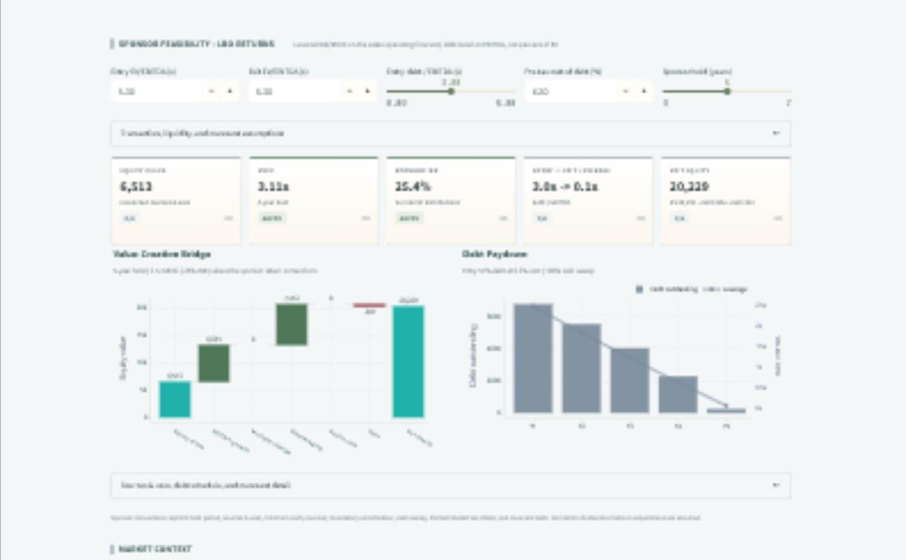](reports/sample/browser/current/08e_sponsor_returns.png) | [](reports/sample/browser/current/08e_sponsor_returns.png) |
| Equity check, MOIC, IRR e leverage de entrada/saída sobre o mesmo forecast operacional. | Decomposição entre EBITDA growth, multiple change, deleveraging, caixa excedente e fees. |

| Contexto de mercado | Proveniência das premissas |
| --- | --- |
| [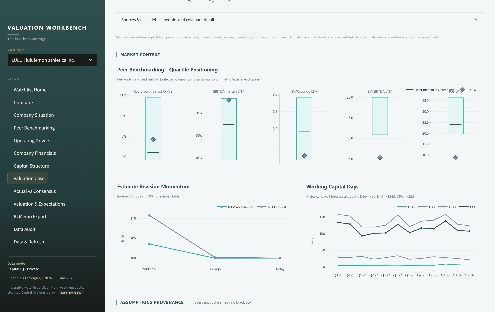](reports/sample/browser/current/08f_market_context.png) | [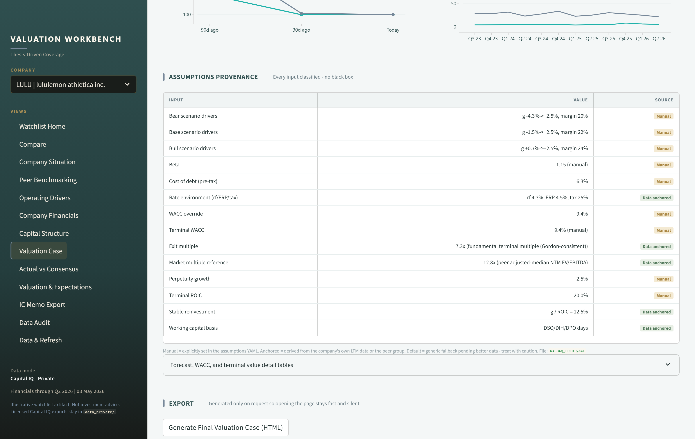](reports/sample/browser/current/08g_provenance_and_export.png) |
| Quartis dos peers, revisions e working-capital days ajudam a testar se a narrativa operacional sustenta o valuation. | Cada input revela valor, fonte e classificação; defaults frágeis ficam destacados para revisão. |

[](reports/sample/browser/current/08g_provenance_and_export.png)

O HTML standalone é gerado somente sob demanda e replica a mesma versão de premissas usada na interface.

No case demonstrativo, a Lululemon apresenta preço de referência de **US$ 113,62** e WACC de **9,4%**. O DCF utiliza crescimento de longo prazo de **2,5%**, ROIC terminal de **20,0%** e múltiplo fundamental implícito de **7,3x**. O valor indicativo é de **US$ 115,98** no Bear, **US$ 159,80** no Base e **US$ 187,25** no Bull. A mediana ajustada de **12,8x EV/EBITDA NTM** dos peers permanece como cross-check de upside, não como premissa terminal do Base. No sponsor screen, o cenário Base produz **2,04x MOIC** e **15,4% de IRR**, evidenciando que a assimetria é mais atraente como recuperação em public equities do que como take-private nos parâmetros atuais.

## Valuation e expectativas do mercado

Este bloco encerra o `Valuation Case`, confrontando o underwriting intrínseco com histórico de múltiplos, posicionamento relativo e expectativas implícitas no preço.

| Multi-multiple scorecard | Histórico de múltiplos |
| --- | --- |
| [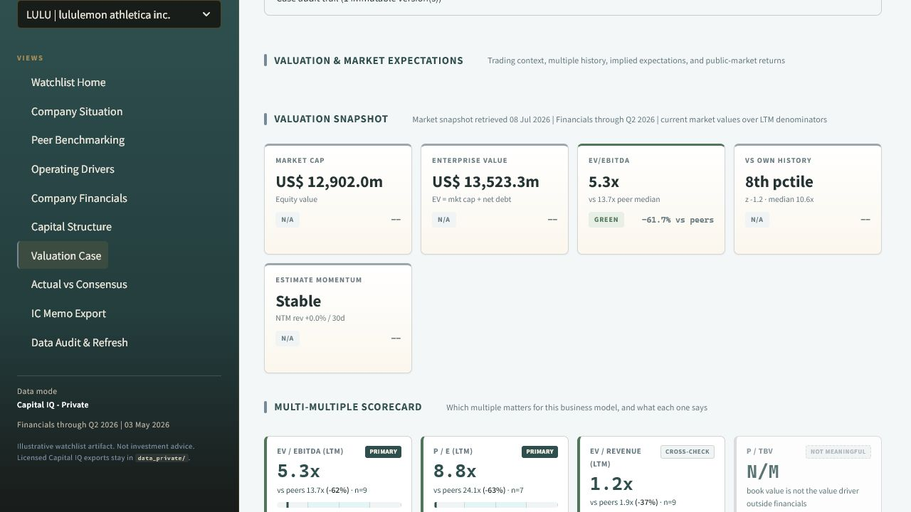](reports/sample/browser/current/09_valuation_snapshot.jpg) | [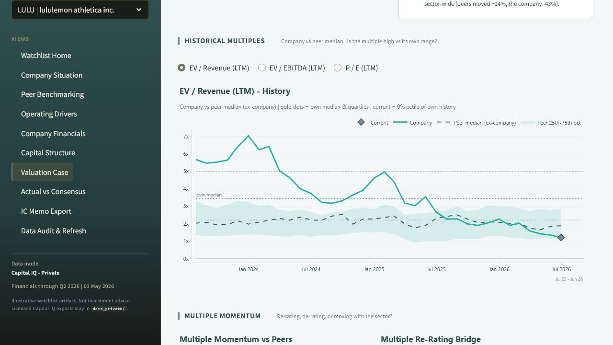](reports/sample/browser/current/09b_historical_multiples.jpg) |
| O sistema escolhe múltiplos relevantes por business model e separa primary, cross-check e not meaningful. | Série histórica da companhia contra mediana e quartis dos peers, com leitura de re-rating e de-rating. |

[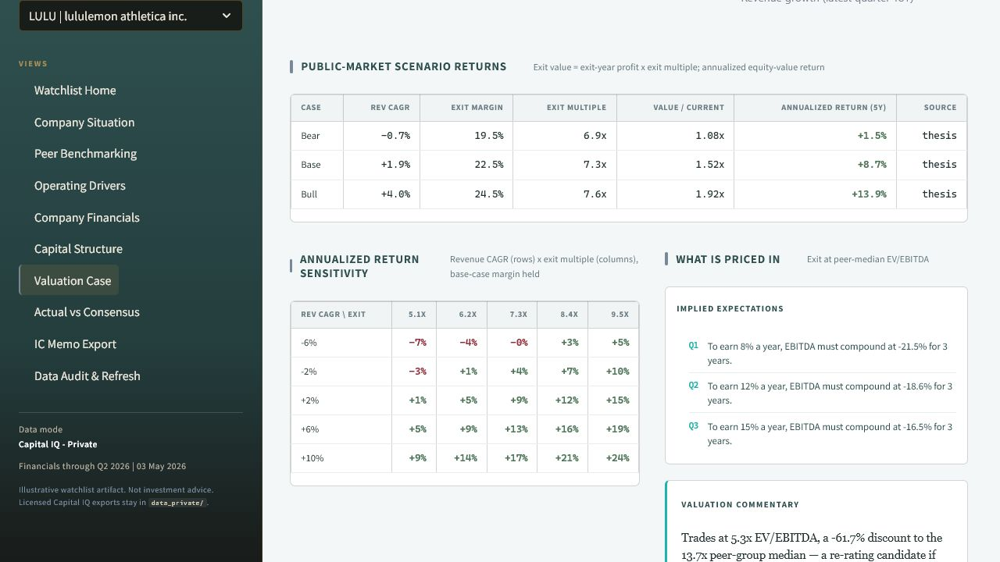](reports/sample/browser/current/09c_scenario_returns.jpg)

O módulo converte preço e múltiplo em expectativas implícitas, retornos anualizados por cenário e sensibilidade de crescimento versus exit multiple.

## Material para decisão

[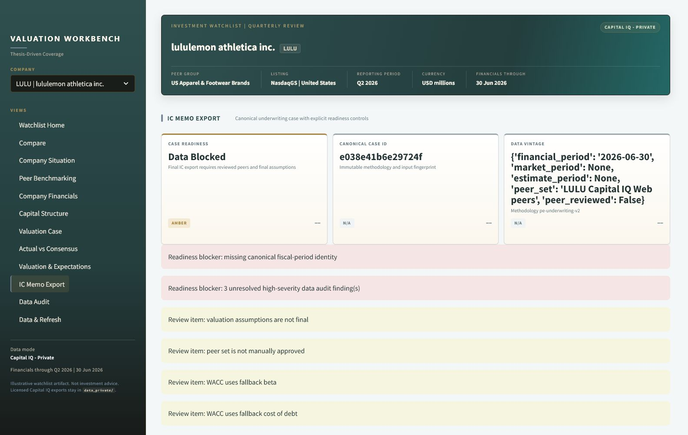](reports/sample/browser/current/10_ic_memo_export.png)

O memo reúne situação, business quality, variant perception, valuation, cenários, catalisadores, riscos, perguntas de diligência, decisão e próximos passos em um único documento exportável.

## Integridade e proveniência

| Auditoria de dados | Refresh, cobertura e proveniência |
| --- | --- |
| [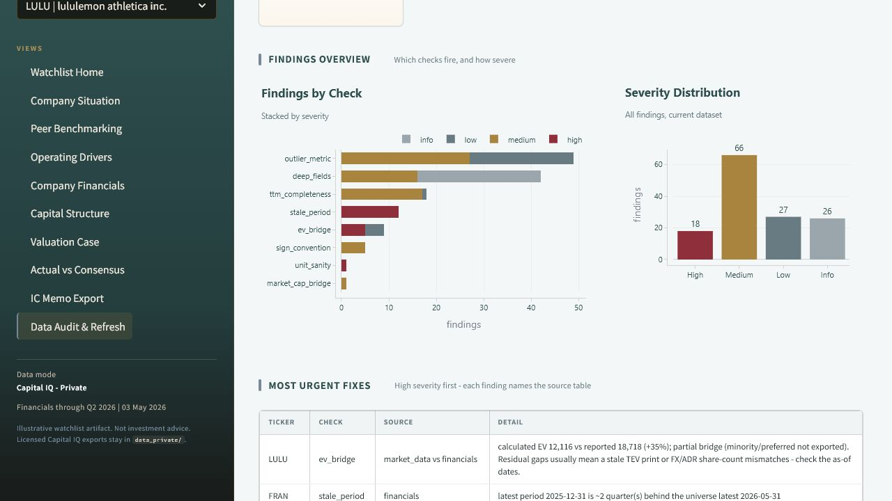](reports/sample/browser/current/11_data_audit_charts.jpg) | [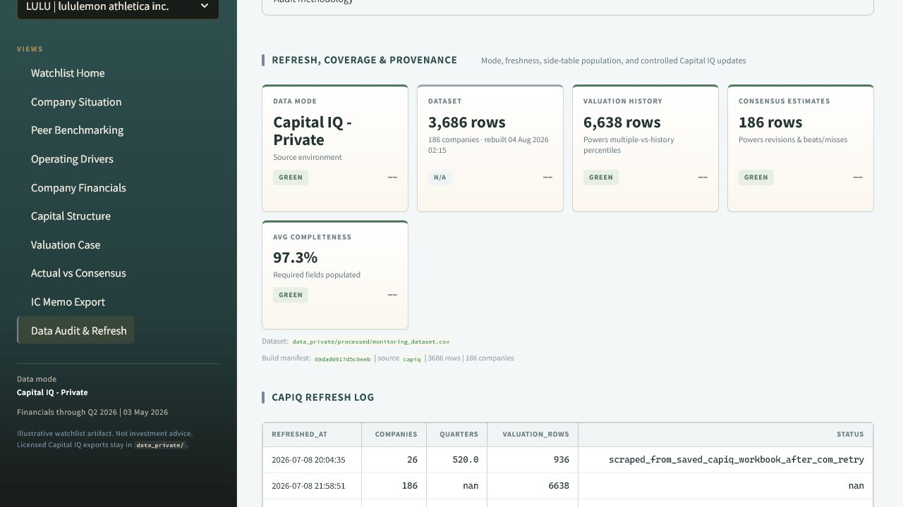](reports/sample/browser/current/12_data_governance.jpg) |
| A página única `Data Audit & Refresh` identifica currency/unit mismatch, TTM incompleto, stale period, EV bridge, market-cap bridge, sinais incorretos e outliers. | No mesmo fluxo ficam cobertura, completeness, valuation history, estimates, source log e histórico de refresh do Capital IQ. |

| Fila de exceções | Source log |
| --- | --- |
| [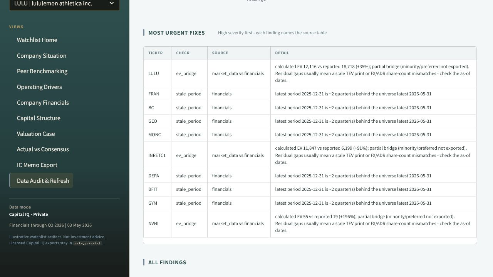](reports/sample/browser/current/11b_urgent_findings.jpg) | [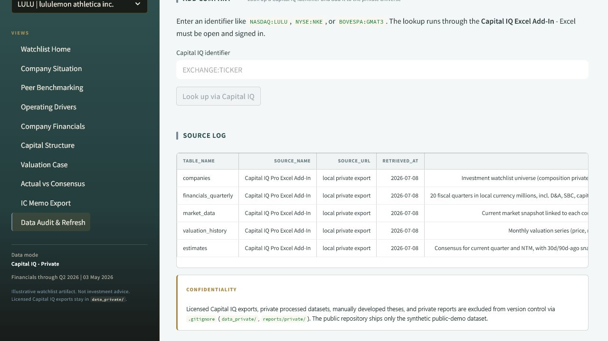](reports/sample/browser/current/12c_source_log.jpg) |
| Os achados prioritários permanecem visíveis até correção ou revisão documentada. | Cada dataset informa origem, período, cobertura e status de atualização. |

[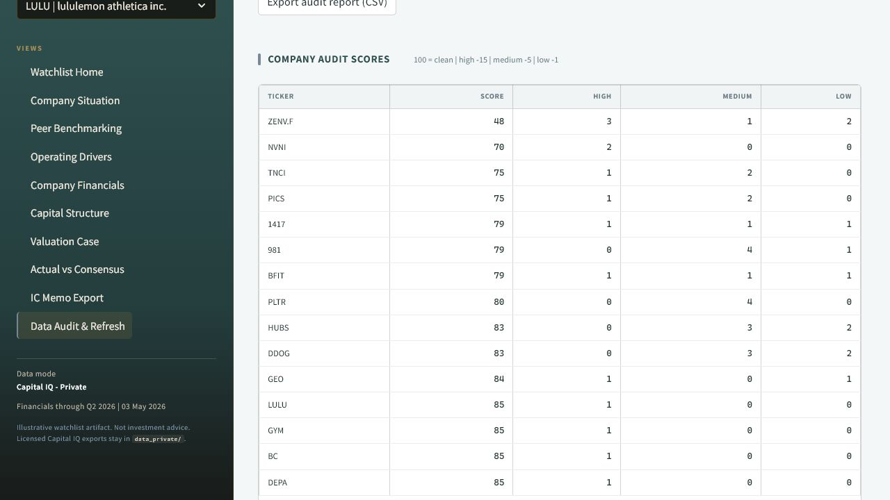](reports/sample/browser/current/11c_company_audit_scores.jpg)

O painel de audit scores compara completude, consistência e severidade dos achados entre todas as companhias monitoradas, permitindo priorizar a revisão dos dados antes do uso analítico.

[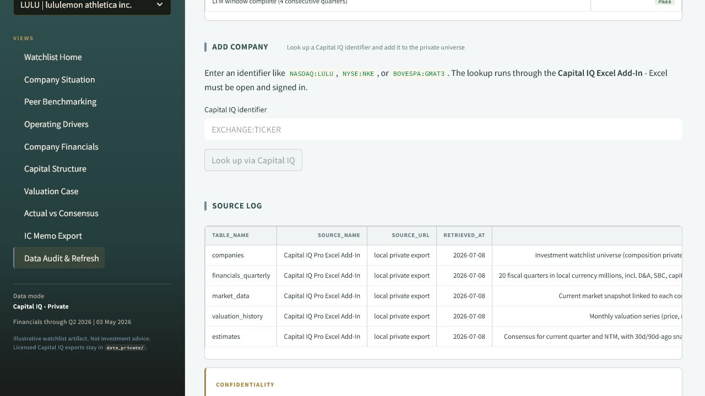](reports/sample/browser/current/12b_add_company.jpg)

Novas companhias podem ser incluídas por identificador, como `NASDAQ:LULU`, `NYSE:NKE` ou `BOVESPA:GMAT3`. O lookup utiliza o Capital IQ Excel Add-In autenticado localmente e mantém os dados licenciados fora do repositório.

## O que a plataforma automatiza

- Importação e normalização de financials trimestrais, market data, estimates e valuation history.
- Arquiteturas de receita por business model, KPIs operacionais, segmentos reportados e reconciliação Capital IQ versus filings.
- TTM/NTM, crescimento, margens, cash conversion, leverage, ROIC/ROE e múltiplos.
- Peer statistics com a companhia analisada excluída da mediana e tratamento explícito de outliers.
- DCF, WACC, sensitivities, football field, debt capacity, sponsor returns e report assembly.
- Data audit, proveniência e controles contra campos incorretos, inconsistentes ou incompletos.

## Onde entra a revisão manual

- Aprovação, rejeição e justificativa dos peers.
- Premissas operacionais, WACC, terminal value e cenários.
- Aprovação dos drivers físicos, definições, fontes e divergências entre Capital IQ e filings.
- Tese, variant perception, catalisadores, riscos e perguntas para management.
- Interpretação dos resultados, diligência adicional e recomendação final.

A metodologia completa de DCF, steady state, proveniência e classificação dos
diagnósticos está documentada em [docs/methodology.md](docs/methodology.md).
O contrato de KPIs, as equações por business model e o fluxo de reconciliação
estão em [docs/operating_driver_methodology.md](docs/operating_driver_methodology.md).

## Capital IQ e confidencialidade

Arquivos brutos, bases tabulares derivadas, teses completas e relatórios privados permanecem em `data_private/`, fora do versionamento. O repositório contém apenas screenshots estáticos selecionados, sem os arquivos-fonte licenciados nem informação suficiente para reconstruir a base privada.

<details>
<summary><strong>Arquitetura e stack</strong></summary>

```text
src/
  ingestion/      loaders, schemas, universe and Capital IQ import workflow
  modeling/       metrics, peers, consensus, capital structure, DCF and safeguards
  app/            Streamlit pages and reusable interface components
  reporting/      charts, valuation cases, board packs and IC memos
  pipeline/       normalized dataset build
data/
  templates/      import and manual-input schemas
  reference/      public reference parameters
  sample/         offline demonstration data
tests/            financial logic, data quality, privacy and application tests
```

Stack principal: **Python, pandas, Streamlit, Plotly, Matplotlib, Jinja, PowerShell, Pytest e S&P Capital IQ Pro Excel Add-In**.

</details>

<details>
<summary><strong>Executando a demonstração</strong></summary>

```powershell
pip install -e .
python -m src.pipeline.build_dataset --source public-demo
streamlit run src/app/streamlit_app.py -- --demo
```

Para validar o projeto:

```powershell
pytest
python scripts/check_git_hygiene.py
```

Outputs HTML da demonstração pública:

- [IC Memo de Alphabet](reports/sample/ic_memo_GOOGL.html)
- [Valuation Case de Alphabet](reports/sample/valuation_case_GOOGL.html)

</details>

<details>
<summary><strong>Limitações</strong></summary>

- A qualidade de uma análise de comps depende da revisão humana do peer set.
- Debt capacity não substitui documentação de dívida, covenants, ratings e condições de mercado.
- DCF e múltiplos dependem da qualidade das premissas e não eliminam risco de modelagem.
- O modo completo depende de acesso autorizado ao Capital IQ e dos campos incluídos no export local.

</details>

---

Projeto desenvolvido como demonstração de análise financeira, valuation, automação e julgamento de investimento. Não constitui recomendação de compra ou venda de valores mobiliários.
